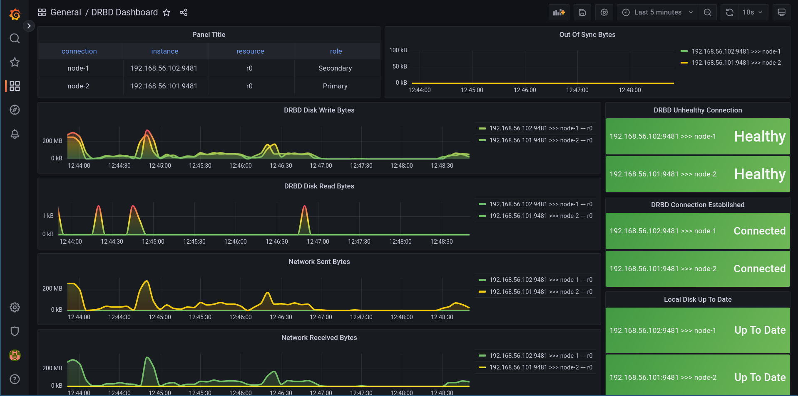

# drdb9\_exporter

This is a Prometheus exporter that, when running on a node, checks the status
of that node's DRBD volumes. You can use the Grafana sample dashboard at `grafana-dashboard` directory and visualize your metrics.
Here's what it looks like:



## Installation

To build the deb file:

```
debuild -b -uc -us
```

To build the binary:

```bash
make
```

```bash
CGO_ENABLED=0 go build
```

To build and run the Docker container:

```bash
docker build -t drbd9-exporter .
docker run -p 9481:9481  -v '/sys/kernel/debug:/sys/kernel/debug' --name drbd9-exporter drbd9-exporter
```

After you've launched the exporter, import the Grafana dashboard file at `grafana-dashboard/drbd-grafana-dashboard.json` to your Grafana server.

## Usage

Command-line options:

```plain
Usage of drbd9_exporter:
  -web.listen-address string
    	Address on which to expose metrics and web interface (default ":9481")
  -web.telemetry-path string
    	Path under which to expose metrics. (default "/metrics")
```

## Assumptions

This exporter assummes that you are running DRBD 9.0 and have the 
debugfs mounted, most distros do, but if you don't then you can 
manually mount the debugfs by doing:

```bash
mount -t debugfs nodev /sys/kernel/debug
```

## Example export

```plain
# HELP drbd_activitylog_writes Number of updates of the activity log area of the meta data.
# TYPE drbd_activitylog_writes gauge
drbd_activitylog_writes{connection="n2",id="0",resource="r0"} 0
drbd_activitylog_writes{connection="n3",id="0",resource="r0"} 0
# HELP drbd_bitmap_writes Number of updates of the bitmap area of the meta data.
# TYPE drbd_bitmap_writes gauge
drbd_bitmap_writes{connection="n2",id="0",resource="r0"} 0
drbd_bitmap_writes{connection="n3",id="0",resource="r0"} 0
# HELP drbd_connection_established a
# TYPE drbd_connection_established gauge
drbd_connection_established{connection="n2",id="0",resource="r0"} 1
drbd_connection_established{connection="n3",id="0",resource="r0"} 1
# HELP drbd_connection_unhealthy a
# TYPE drbd_connection_unhealthy gauge
drbd_connection_unhealthy{connection="n2",id="0",resource="r0"} 0
drbd_connection_unhealthy{connection="n3",id="0",resource="r0"} 0
# HELP drbd_disk_read_bytes Net data read from local hard disk.
# TYPE drbd_disk_read_bytes gauge
drbd_disk_read_bytes{connection="n2",id="0",resource="r0"} 262056
drbd_disk_read_bytes{connection="n3",id="0",resource="r0"} 262056
# HELP drbd_disk_written_bytes Net data written on local hard disk.
# TYPE drbd_disk_written_bytes gauge
drbd_disk_written_bytes{connection="n2",id="0",resource="r0"} 0
drbd_disk_written_bytes{connection="n3",id="0",resource="r0"} 0
# HELP drbd_epochs Number of Epochs currently on the fly.
# TYPE drbd_epochs gauge
drbd_epochs{connection="n2",id="0",resource="r0"} 1
drbd_epochs{connection="n3",id="0",resource="r0"} 1
# HELP drbd_local_disk_up_to_date a
# TYPE drbd_local_disk_up_to_date gauge
drbd_local_disk_up_to_date{connection="n2",id="0",resource="r0"} 1
drbd_local_disk_up_to_date{connection="n3",id="0",resource="r0"} 1
# HELP drbd_local_pending Number of open requests to the local I/O sub-system.
# TYPE drbd_local_pending gauge
drbd_local_pending{connection="n2",id="0",resource="r0"} 0
drbd_local_pending{connection="n3",id="0",resource="r0"} 0
# HELP drbd_network_received_bytes Volume of net data received by the partner via the network connection.
# TYPE drbd_network_received_bytes gauge
drbd_network_received_bytes{connection="n2",id="0",resource="r0"} 0
drbd_network_received_bytes{connection="n3",id="0",resource="r0"} 0
# HELP drbd_network_sent_bytes Volume of net data sent to the partner via the network connection.
# TYPE drbd_network_sent_bytes gauge
drbd_network_sent_bytes{connection="n2",id="0",resource="r0"} 131028
drbd_network_sent_bytes{connection="n3",id="0",resource="r0"} 131028
# HELP drbd_out_of_sync_bytes Amount of data known to be out of sync.
# TYPE drbd_out_of_sync_bytes gauge
drbd_out_of_sync_bytes{connection="n2",id="0",resource="r0"} 0
drbd_out_of_sync_bytes{connection="n3",id="0",resource="r0"} 0
# HELP drbd_remote_unacknowledged Number of requests received by the partner via the network connection, but that have not yet been answered.
# TYPE drbd_remote_unacknowledged gauge
drbd_remote_unacknowledged{connection="n2",id="0",resource="r0"} 0
drbd_remote_unacknowledged{connection="n3",id="0",resource="r0"} 0
# HELP drbd_device_role role of drbd device
# TYPE drbd_device_role gauge
drbd_device_role{connection="n2",id="0",resource="r0",role="Primary"} 0
drbd_device_role{connection="n3",id="0",resource="r0",role="Secondary"} 0
```
